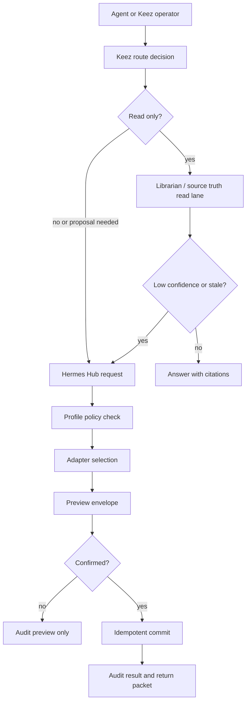
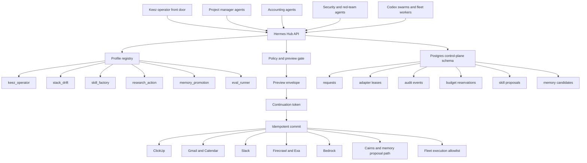

# Keez North Star V2 Hermes Hub Roadmap

<!-- markdownlint-disable MD013 -->

## Status

Candidate roadmap capture, created 2026-05-16.

This document keeps the Keez Hermes Hub design in the Hermes repo so the architecture, candidate use cases, and implementation sequence are not scattered across chat history or downstream task notes.

Research expansion captured 2026-05-16 from a capped Exa and Firecrawl pass. The outside research supports the same direction: keep the Hub simple, make the action boundary explicit, persist the preview/commit lifecycle, and treat tool interfaces as agent-facing products instead of raw CRUD wrappers.

## Operating Decision

Keez should start with one shared Hermes Hub under the operator front door, not several always-on Hermes services. The Hub exposes scoped capability profiles that agents can call as needed. Separate Hermes instances should only be added later for hard isolation cases, such as external client data boundaries, high-risk write domains, conflicting runtime dependencies, or dedicated performance lanes.

Keez remains the operator front door. Librarian remains the shared read and source-truth lane. Hermes becomes the proposal and action sidecar for research, drift checks, skill proposals, memory candidates, live evals, and gated follow-up writes.

## Current Keez Integration Baseline

The current Keez-side Hermes engine lives in the RAGnos workspace home-agent service layer:

- Engine server: `/Users/huntercanning/dev/ragnos/workspace/tools/home-agent/src/home_agent/hermes_engine_server.py`
- Engine client: `/Users/huntercanning/dev/ragnos/workspace/tools/home-agent/src/home_agent/hermes_engine_client.py`
- Keez socket daemon integration: `/Users/huntercanning/dev/ragnos/workspace/tools/home-agent/src/home_agent/socket_daemon.py`
- Hermes audit/write boundary: `/Users/huntercanning/dev/ragnos/workspace/tools/home-agent/src/home_agent/hermes_adapter.py`
- Launchd label: `io.ragnos.keez-hermes-engine`
- Local endpoint: `127.0.0.1:8791`

The first live eval slice proved capped execution across Firecrawl, Bedrock, ClickUp, memory proposal, skill proposal, and negative write cases. The next step is to turn that proof into a real Hub contract with profiles, persistence, concurrency controls, and reusable adapter selection.

## Candidate Use Cases

### Stack Drift Scout

Hermes checks docs, public APIs, repo runtime assumptions, launchd state, and tool behavior for drift. It produces previewable drift packets with evidence, impact, and proposed follow-up tasks. It does not directly rewrite source docs or ship changes.

### Skill Factory

Hermes watches repeated workflows and proposes new `SKILL.md` artifacts with metadata. It writes proposals to a review directory only. Install, activation, and runtime behavior changes stay human or agent reviewed.

### Research-to-Action Pipeline

Hermes can combine Firecrawl, Bedrock, repo context, and task context into actionable packets. The output should be ClickUp tasks, research summaries, candidate implementation plans, or previewable follow-up actions, never silent live writes.

### Memory Promotion Assistant

Hermes can identify useful memory candidates and prepare promotion packets. It must not import directly into canonical truth. Librarian, Canonical, and Cairns boundaries remain explicit and observable.

### Operator QA / Live Eval Runner

Hermes can run capped live evals against Keez, adapters, and stack workflows. It records successes, failures, cost, and bugs, then proposes fixes or tasks.

## Hub Profiles

The Hub should start with lightweight profile configs. A profile is a scoped capability set with allowed adapters, write policy, budget policy, audit category, and output shape.

- `stack_drift`: docs, API, runtime, and dependency drift checks.
- `skill_factory`: repeated workflow detection and skill proposal generation.
- `research_action`: Firecrawl, Bedrock, repo context, and task packet generation.
- `memory_promotion`: memory candidates and promotion packets only.
- `eval_runner`: capped live evals, bug logs, and result packets.

Example agent-facing request shape:

```json
{
  "profile_id": "research_action",
  "request_id": "req_...",
  "source_refs": ["repo:path", "clickup:86ahgtufe"],
  "budget_cap_usd": 1.0,
  "intent": "turn this research into candidate follow-up tasks",
  "preview_required": true
}
```

## Adapter Model

Agents should be able to ask the Hub for the adapters they need, subject to the selected profile. The Hub owns the adapter registry and policy checks. Individual agents should not each reinvent ClickUp, Slack, Gmail, Calendar, Firecrawl, Bedrock, memory, or fleet execution wiring.

Plainly, an accounting agent, project manager agent, security agent, or red-team agent should call the same Hermes Hub with different profile and adapter permissions:

- Accounting profile: invoices, time logs, finance packet drafting, no silent sends.
- Project manager profile: ClickUp task reads/writes after preview, roadmap packet generation.
- Security profile: drift, dependency checks, suspicious behavior summaries, no broad execution.
- Red-team profile: eval cases, controlled probes, bug reports, no uncontrolled destructive actions.
- Keez operator profile: interactive preview, confirmation, and audited commit.

## Postgres V2 Control Plane

Hermes Hub V2 should use the existing RAGnos Postgres pattern rather than creating a new Postgres server. The preferred shape is a separate `hermes_hub` schema or database inside the control-plane Postgres environment.

Do not store Hermes coordination state in the GraphRAG or Cairns LightRAG database. Those systems are knowledge/read lanes. Hermes needs control-plane state: requests, previews, commits, adapters, leases, budgets, audit rows, and proposals.

Recommended first tables:

- `hermes_agents`: registered callers and scopes.
- `hermes_profiles`: capability profiles and policy metadata.
- `hermes_adapters`: adapter registry and health state.
- `hermes_profile_adapters`: which profiles may use which adapters.
- `hermes_requests`: incoming requests and lifecycle state.
- `hermes_previews`: preview envelopes and continuation tokens.
- `hermes_commits`: confirmed commit attempts and results.
- `hermes_audit_events`: append-only audit log.
- `hermes_skill_proposals`: proposed skills awaiting review.
- `hermes_memory_candidates`: memory promotion candidates awaiting review.

## Concurrency And Swarm Safety

The Hub must support multiple agents calling Hermes at the same time. The safe design is a stateless API backed by Postgres coordination.

Core rules:

- Every request has a `request_id`.
- Every preview has a signed or persisted `continuation_token`.
- Every commit uses an `idempotency_key`.
- Duplicate commits return the prior result instead of repeating the action.
- Budget reservations are atomic.
- Adapter leases and rate limits are stored centrally.
- Worker queues use transactional claiming, such as `FOR UPDATE SKIP LOCKED`.
- Preview and commit decisions are audited.

This lets a fleet or swarm call Hermes in parallel without double-posting, double-spending, or racing on the same adapter.

## Routing Flow



## Scaling Flow



The plain-speak scaling model is: every team agent calls the same Hub, but the selected profile decides what adapters it can use, what budget it can spend, what outputs it may produce, and whether it may commit anything. This avoids a pile of always-on Hermes daemons while still letting the organization chart grow into specialized AI teams.

## Forbidden Or Gated Classes

These remain blocked or explicitly gated:

- Delete operations.
- Source-doc edits from Hermes.
- Uncontrolled `ship` or `m2m`.
- Direct canonical memory import.
- Unbounded fleet execution.
- Any write without preview and confirmation.

## Layered Deployment Roadmap

### Wave 0: Contract Lock

Lock the request, preview, commit, status, audit, and profile shapes before broad adapter work. This wave defines `request_id`, `profile_id`, `source_refs`, `budget_cap_usd`, `continuation_token`, `idempotency_key`, and the forbidden classes. It also defines the first profile registry entries and adapter metadata fields.

### Wave 1: Keez Guinea Pig

Keez is the first real caller because it already has operator intent, preview UI, local runtime checks, and a clear confirmation loop. Start with preview-only Hub calls for stack drift, skill proposal, research packet, memory candidate, and capped eval output. The goal is to prove the Hub fits Keez without making every adapter live at once.

### Wave 2: Postgres-Backed Hub

Move from in-memory proof to durable control-plane state. Use the existing RAGnos Postgres environment with a dedicated `hermes_hub` schema or database, not the GraphRAG or Cairns LightRAG stores. Persist requests, previews, continuation tokens, commits, audit events, budgets, adapter leases, skill proposals, and memory candidates.

### Wave 3: Useful Adapter Commits

Enable narrow confirmed writes one adapter at a time. Start with ClickUp task/comment creation because it is operationally visible and reversible enough for early proof. Then add Gmail draft only, Calendar event draft/create behind confirm, Slack draft/post only if durable credentials are healthy, Cairns/memory proposals only, and fleet execution only through an allowlist.

### Wave 4: Agent Org Expansion

Open the Hub to more profiles after Keez proves the path: project manager, accounting, security, red-team, and swarm worker profiles. Each profile gets explicit adapter permissions, budget rules, output contracts, and audit categories. This is where the organization chart starts using Hermes as shared infrastructure.

### Wave 5: Production Hub

Make the Hub operationally boring: launchd service health, runtime doctor checks, adapter health dashboards, spend reports, replay and eval suites, stale lease cleanup, incident logs, and runbooks. This wave is about reliability and governance, not new adapter sprawl.

## First Implementation Slices

1. Add a Hermes Hub profile registry contract.
2. Add Postgres DDL for the `hermes_hub` control-plane schema.
3. Back preview and commit state with Postgres records.
4. Move Skill Factory proposal output into the Hub profile model.
5. Add agent profile examples for accounting, project management, security, red-team, and Keez operator usage.
6. Run one live eval with two concurrent callers to prove idempotency, adapter leases, budget caps, and audit logs.

Recommended first build order:

1. Define the `keez_operator` profile and keep it preview-first.
2. Add the Postgres schema and idempotency constraints.
3. Add Hub API endpoints for `preview`, `commit`, and `status`.
4. Wire Keez to one preview-only Hub route.
5. Add ClickUp confirmed commit as the first live adapter write.
6. Add Skill Factory proposal output, still review-only.
7. Add Cairns/memory proposal output, still not canonical import.
8. Run two concurrent Keez/Hermes requests against the same adapter to prove duplicate commits do not happen.
9. Open profile configs for project manager, accounting, security, and red-team agents.

## External Research Notes: Exa And Firecrawl, 2026-05-16

The research pass used seven Exa searches at about `0.049` dollars total, based on returned `costDollars` fields. Firecrawl was used for search plus targeted page scraping; the search calls reported 26 credits total, and single-page scrape responses did not return a usable per-call credit number in the response body. This stayed well inside the requested caps.

Findings folded into this roadmap:

- Keep the Hub simple first. Anthropic's agent guidance favors simple, composable patterns and warns that agentic systems trade latency and cost for better performance. For Hermes, that means profiles and policy before a large agent org chart.
- Human approval should be resumable state, not a transient UI prompt. LangGraph's interrupt model persists the workflow state and resumes by thread ID; the Hermes equivalent is a persisted preview plus continuation token.
- Any side effect before approval or resume must be idempotent. LangGraph specifically calls out duplicate side effects as a replay hazard. Hermes commits therefore need idempotency keys, result re-read, and duplicate-result return.
- Durable execution depends on deterministic replay and stored checkpoints. For Hermes, Postgres is the checkpoint layer for requests, previews, commits, leases, budgets, and audit events.
- Postgres `FOR UPDATE SKIP LOCKED` is a good fit for queue-like adapter work, but it intentionally gives an inconsistent view. Use it for concurrent worker claiming, not general truth reads.
- MCP gives a useful tool discovery and call shape, but its own spec puts validation, access control, rate limiting, output sanitization, confirmation, timeouts, and audit logging on the tool/client implementation. Hermes needs those policies in the Hub, not just adapter wrappers.
- Agent-facing tools should expose semantic phases like search, resolve, preview, execute, verify, and recover. A 2026 agent-first API paper argues that raw CRUD interfaces force agents into brittle ID guessing and ad hoc recovery. Hermes should use raw SDKs underneath but expose agent-native preview/verify contracts above them.
- Exa is useful for quick search, answer, citations, and structured output. It should be a research adapter with budget caps and source refs, not a source of truth.
- Firecrawl is useful when Hermes needs clean page content in the same search pass. Its domain filters, time filters, and scraped markdown options fit the `research_action` and `stack_drift` profiles.

Research sources:

- [Anthropic, "Building effective agents"](https://www.anthropic.com/engineering/building-effective-agents)
- [LangGraph interrupts](https://docs.langchain.com/oss/python/langgraph/interrupts)
- [LangGraph durable execution](https://docs.langchain.com/oss/python/langgraph/durable-execution)
- [Model Context Protocol tools spec](https://modelcontextprotocol.io/specification/2025-11-25/server/tools)
- [PostgreSQL `SELECT` locking clause docs](https://www.postgresql.org/docs/current/sql-select.html)
- [Firecrawl search docs](https://docs.firecrawl.dev/features/search)
- [Exa search docs](https://exa.ai/docs/reference/search)
- [Exa answer docs](https://exa.ai/docs/reference/answer)
- [Agent-First Tool APIs paper](https://arxiv.org/html/2605.10555v1)

## ClickUp Anchor

Keez lane: [86ahgtufe](https://app.clickup.com/t/86ahgtufe)

The ClickUp task created for this roadmap should point back to this file and track the Keez North Star V2 Hermes Hub implementation path.
